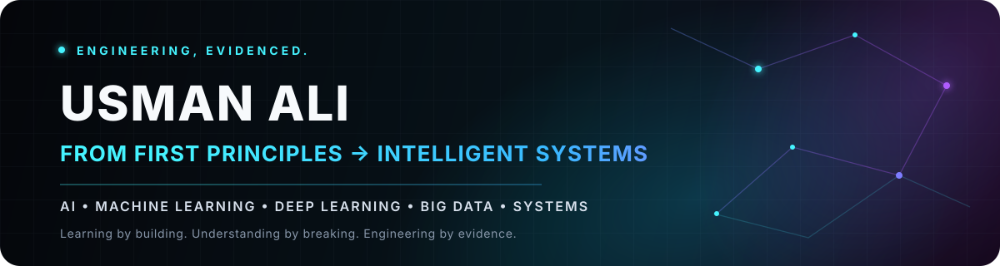

### Learning intelligent systems by building them

**AI · Machine Learning · Deep Learning · Big Data Analytics · Systems Engineering**

---

## The engineering question I keep coming back to

I’m interested in the part of AI that begins after **“the model works.”**

A useful intelligent system is more than a notebook result. It depends on the quality of the data, the assumptions behind the model, the software around it, the compute underneath it, the infrastructure that serves it, and the feedback loops that keep it reliable in the real world.

I’m building my understanding across that complete path — from mathematical foundations and learning algorithms to deep learning, big-data systems, distributed compute, cloud infrastructure, and product engineering.

> **The goal is not to collect technologies. It is to understand enough of the stack to build intelligent systems deliberately.**

---

## Current lab

My active work in [`ai-engineer-journey`](https://github.com/usman611b/ai-engineer-journey) currently turns mathematical ideas into executable experiments: optimization behavior, loss landscapes, learning-rate schedules, momentum, Adam, and benchmark problems.

The repository is intentionally built as a **lab notebook in public**:

**concept → implementation → experiment → intuition → system thinking**

---

## Engineering surface

<table>
<tr>
<td width="33%" valign="top">

### Intelligence
- Machine learning foundations
- Deep learning & neural networks
- Computer vision
- Model evaluation
- AI systems & agentic workflows

</td>
<td width="33%" valign="top">

### Data & Compute
- Big data analytics
- Data processing & pipelines
- Parallel & distributed computing
- Experimentation & numerical computing
- Scalable workloads

</td>
<td width="33%" valign="top">

### Systems
- Cloud infrastructure
- Containers & deployment
- APIs & databases
- CI/CD & reliability
- Full-stack product engineering

</td>
</tr>
</table>

---

## Tools I work with or am actively learning

### AI / ML / Data

### Systems / Cloud / Engineering

---

## Proof of work

<table>
<tr>
<td width="50%" valign="top">

### 🧠 [AI Engineer Journey](https://github.com/usman611b/ai-engineer-journey)
A first-principles AI engineering lab: mathematics, experiments, implementations, and the path from models toward production systems.

`Python` `Math for AI` `Optimization` `ML`

</td>
<td width="50%" valign="top">

### 🎓 [CampusArchive](https://github.com/usman611b/CampusArchive)
A full-stack academic-resource platform designed around organized access, moderated uploads, search, and production-minded deployment.

`TypeScript` `React` `Supabase` `PostgreSQL`

</td>
</tr>
<tr>
<td width="50%" valign="top">

### 🌐 [usmanalii.com](https://github.com/usman611b/usmanalii.com)
My personal career OS — a living system for projects, learning evidence, decisions, and the engineering behind what I build.

`TypeScript` `React` `Cloudflare`

</td>
<td width="50%" valign="top">

### 🏠 [Sharjah Properties](https://github.com/usman611b/sharjah-properties)
A full-stack property platform with discovery flows, administration, authentication, media handling, and consultation workflows.

`React` `Node.js` `Express` `MongoDB`

</td>
</tr>
</table>

---

## How I work

- **Start below the abstraction.** Understand the idea before depending on the framework.
- **Turn theory into executable evidence.** Notes become code; code becomes experiments.
- **Treat failure as signal.** Debugging is part of the learning record, not something to hide.
- **Think beyond the model.** Data, software, infrastructure, deployment, monitoring, and user impact all matter.
- **Keep the record public.** Repositories should show how the thinking evolved, not only the final output.

---

## GitHub signal

 

---

### Engineering, evidenced.

**Portfolio:** [usmanalii.com](https://www.usmanalii.com/) · **GitHub:** [@usman611b](https://github.com/usman611b)

